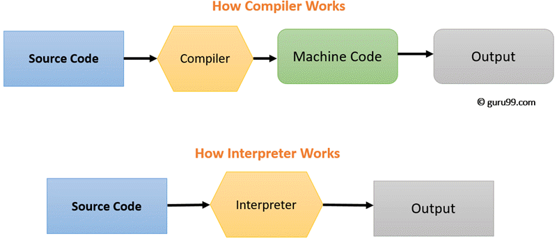
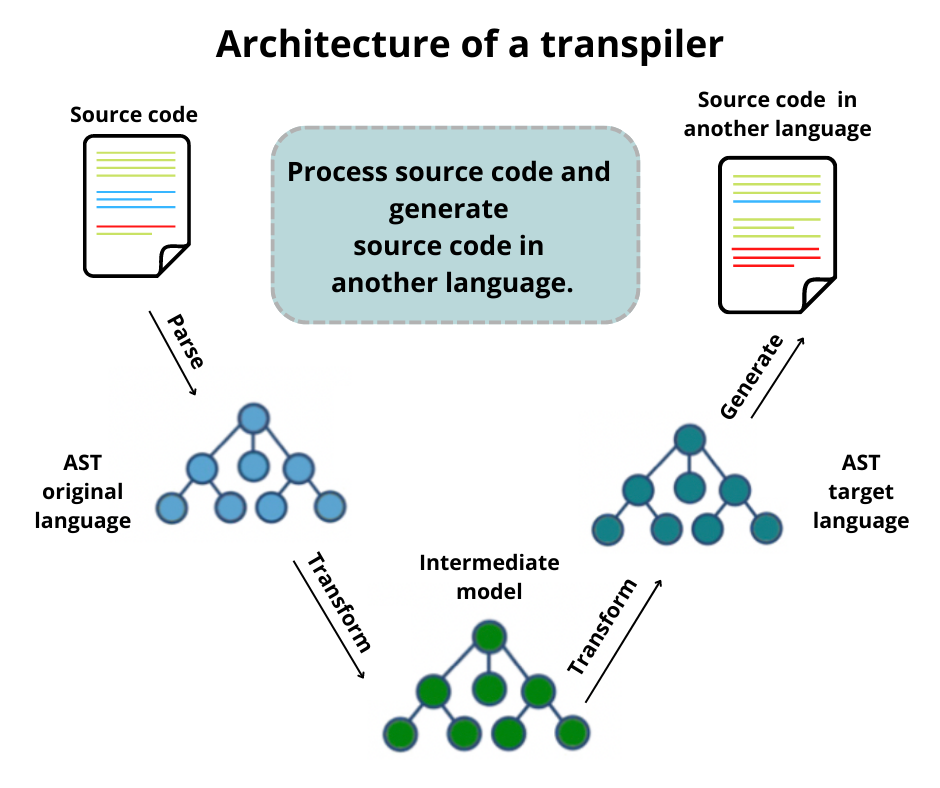
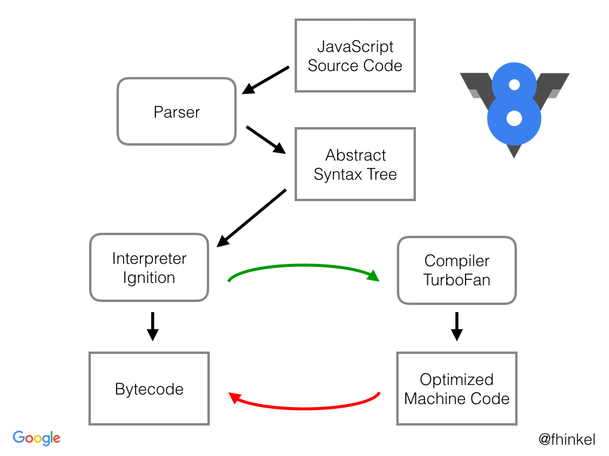

# Interprete

**Un intérprete** es un programa que ejecuta código de un lenguaje de programación traduciendo sus instrucciones a código máquina en tiempo real, línea por línea. A diferencia de un compilador, que traduce el código fuente completo a código máquina antes de su ejecución, un intérprete traduce y ejecuta el código de manera intermitente.

### Pasos de Ejecución de un Intérprete

1. **Análisis Léxico (Lexical Analysis)**
    - **Tokenización**: El código fuente se divide en tokens, que son las unidades léxicas como palabras clave, identificadores y operadores.
2. **Análisis Sintáctico (Syntax Analysis)**
    - **Parsing**: Los tokens se organizan en una estructura de datos llamada AST (Abstract Syntax Tree), que representa la estructura sintáctica del código.
3. **Ejecución Directa**
    - **Evaluación**: El intérprete recorre el AST y ejecuta las instrucciones correspondientes, traduciéndolas a acciones de la máquina en tiempo real.

Un concepto similar pero diferente a este es **Transpilación,** que parece ser mas el objetivo que se quiere lograr, mas que un **intérprete.** 

### Concepto de Transpilación

**La transpilación** es el proceso de traducir el código fuente escrito en un lenguaje de programación a otro lenguaje de programación. La transpilación es comúnmente utilizada para traducir lenguajes de alto nivel a otros lenguajes de alto nivel.

### Pasos de Ejecución en la Transpilación

1. **Análisis Léxico (Lexical Analysis)**
    - **Tokenización**: Similar al proceso en un intérprete, el código fuente se divide en tokens.
2. **Análisis Sintáctico (Syntax Analysis)**
    - **Parsing**: Los tokens se organizan en un AST.
3. **Generación de Código**
    - **Traducción**: El AST se convierte en código fuente del lenguaje de destino.
4. **Ejecución del Código Generado**
    - **Interpretación o Compilación**: El código traducido se ejecuta en su entorno nativo (puede ser interpretado o compilado).

## Diferencia entre ambos:

- **Interpretación**: Ejecuta el código directamente a partir del AST sin necesidad de generar código en otro lenguaje.
- **Transpilación**: Traduce el AST a otro lenguaje de programación y luego ejecuta el código traducido en el entorno del lenguaje de destino.

## Link para mayor informacion:

- [https://es.wikipedia.org/wiki/Intérprete_(informática)](https://es.wikipedia.org/wiki/Int%C3%A9rprete_(inform%C3%A1tica))

## **Interpretes para js | V8 - Node Js**

### **V8 Engine**

**V8** es un motor de JavaScript de código abierto desarrollado por Google. Se utiliza en el navegador web Google Chrome y en Node.js. V8 compila el código JavaScript directamente a código de máquina nativo antes de ejecutarlo, lo que mejora significativamente el rendimiento en comparación con los motores de interpretación tradicionales.

- **Características Principales**:
    - **Compilación Just-In-Time (JIT)**: V8 convierte el código JavaScript a código de máquina durante la ejecución, optimizando el rendimiento.
    - **Garbage Collection**: Implementa una recolección de basura eficiente para gestionar la memoria y eliminar objetos que ya no son necesarios.
    - **Soporte de ECMAScript**: V8 se mantiene actualizado con las últimas características del estándar ECMAScript, lo que incluye nuevas sintaxis y APIs.
    - **Interfaz de Programación de Aplicaciones (API)**: Proporciona APIs para integrar V8 en otros entornos, permitiendo la ejecución de JavaScript fuera del navegador.
    - **Optimización de Carga Inicial y Tiempo de Ejecución**: V8 está diseñado para optimizar tanto la carga inicial de scripts como el rendimiento continuo durante la ejecución.

### **Node.js**

**Node.js** es un entorno de ejecución de JavaScript construido sobre el motor V8 de Google. Permite ejecutar JavaScript en el lado del servidor, lo que extiende las capacidades de JavaScript más allá de la simple manipulación del DOM en un navegador web.

- **Características Principales**:
    - **Asíncrono y Orientado a Eventos**: Node.js utiliza un modelo de I/O no bloqueante y orientado a eventos, lo que permite manejar un gran número de conexiones simultáneas de manera eficiente.
    - **Un Solo Hilo**: Aunque Node.js se ejecuta en un solo hilo, puede manejar operaciones de E/S concurrentemente usando un bucle de eventos.
    - **NPM (Node Package Manager)**: Node.js incluye NPM, el administrador de paquetes más grande del mundo, que proporciona acceso a miles de bibliotecas y herramientas de terceros.
    - **Compatibilidad con Módulos**: Node.js soporta tanto CommonJS como ECMAScript Modules, facilitando la modularización y reutilización del código.
    - **Amplia Gama de Aplicaciones**: Node.js se utiliza para desarrollar desde aplicaciones web y servidores HTTP hasta herramientas de desarrollo y scripts de automatización.

Aclarando que cuando decimos que **“V8 compila el código JavaScript directamente a código máquina nativo antes de ejecutarlo”,** estamos hablando del proceso por el cual el motor V8 traduce el código JavaScript de alto nivel a instrucciones de bajo nivel que la CPU del ordenador puede ejecutar directamente. Este proceso es conocido como **compilación Just-In-Time (JIT)**.

### **Compilación Just-In-Time (JIT)**

La compilación JIT es una técnica en la cual el código de un lenguaje de alto nivel (como JavaScript) se traduce a código máquina en tiempo de ejecución, en lugar de hacerlo previamente como en la compilación tradicional.

### **Clarificación sobre V8 y su Funcionamiento**

El motor V8 de Google no se comporta como un intérprete tradicional que ejecuta el código línea por línea sin compilarlo previamente. En cambio, V8 utiliza una combinación de interpretación y compilación Just-In-Time (JIT) para ejecutar el código JavaScript de manera más eficiente.

### **¿Qué es un Intérprete Tradicional?**

Un intérprete tradicional ejecuta el código fuente directamente, línea por línea, convirtiéndolo a acciones en tiempo real sin compilarlo a código máquina. Este enfoque puede ser menos eficiente porque no permite optimizaciones globales ni la generación de código de máquina nativo optimizado.

### **Diferencia entre un Intérprete Tradicional**

- **Intérprete Tradicional**:
    - Ejecuta el código línea por línea.
    - No realiza compilación previa a código máquina.
    - Menor eficiencia debido a la falta de optimización global.
    - Ejemplo: El intérprete de Python (CPython).
- **V8 Engine**:
    - Inicialmente interpreta el bytecode.
    - Identifica y optimiza las partes del código más usadas mediante compilación JIT.
    - Combina interpretación y compilación para maximizar la eficiencia.
    - Utiliza optimizaciones avanzadas basadas en el perfil de ejecución en tiempo real.