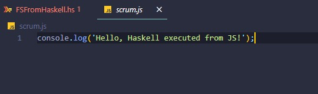

# Ejecución de JS desde Haskell

Usando bibliotecas que permiten la interacción con el sistema operativo y la captura de la salida del proceso de ejecución es posible hacer esto. 

 La biblioteca se llama `System.Process` de Haskell, que permite ejecutar comandos del sistema operativo y capturar su salida.

## Pasos

- **Paso 1:** **Generar el Código JavaScript**
    
    Simulando una función en Haskell que genera código JavaScript a partir de un DSL o cualquier otra fuente.
    
    ```haskell
    generateJavaScript :: String -> String
    generateJavaScript input = "console.log('" ++ input ++ "');"
    ```
    
- **Paso 2: Escribir el Código JavaScript a un Archivo**
    
    Escribir el código JavaScript generado a un archivo temporal.
    
    ```haskell
    import System.IO (writeFile)
    
    writeJavaScriptToFile :: String -> IO FilePath
    writeJavaScriptToFile code = do
        let filePath = "scrum.js"
        writeFile filePath code
        return filePath
    ```
    
- **Paso 3: Ejecutar el Código JavaScript y Capturar la Salida**
    
    Usando `System.Process` para ejecutar el archivo JavaScript con Node.js y capturar la salida.
    
    ```haskell
    import System.Process (readProcess)
    
    executeJavaScript :: FilePath -> IO String
    executeJavaScript filePath = readProcess "node" [filePath] ""
    ```
    
- **Paso 4: Integrar Todo y Mostrar el Resultado**
    
    Combinando todo tenemos: 
    
    ```haskell
    main :: IO ()
    main = do
        let input = "Hello, Haskell executed from JS!"
        let jsCode = generateJavaScript input
        filePath <- writeJavaScriptToFile(jsCode)
        result <- executeJavaScript(filePath)
        putStrLn $ "Result from JavaScript: " ++ result
    ```
    

### Bibliotecas Utilizadas

- **System.IO**: Para escribir archivos.
- **System.Process**: Para ejecutar comandos del sistema operativo y capturar su salida.

### Pruebas de su funcionamiento

Archivo `scrum.js` creado:



Captura de la salida de js en Haskell

